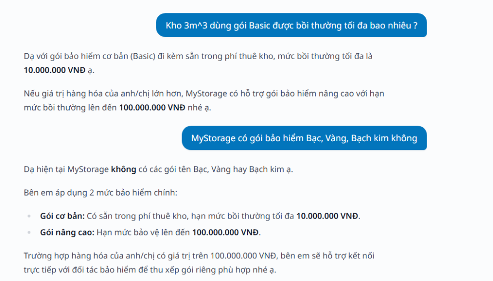
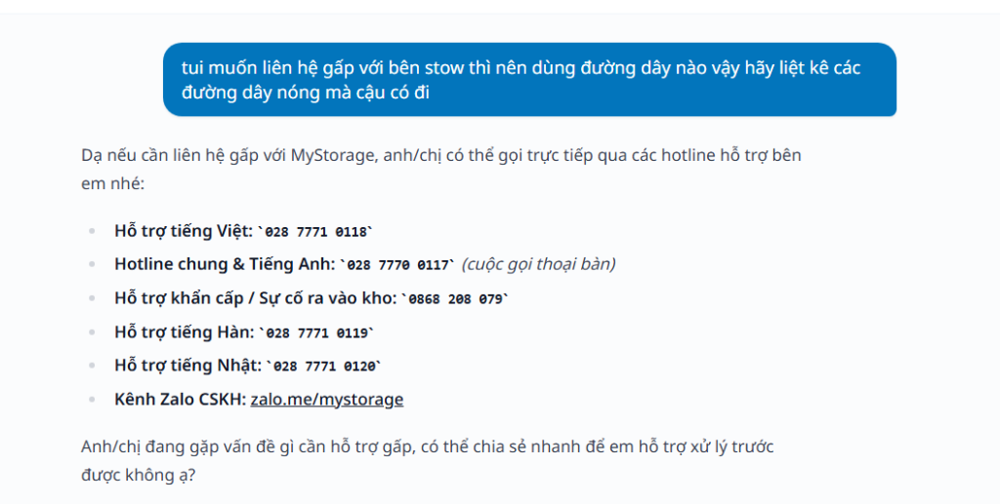
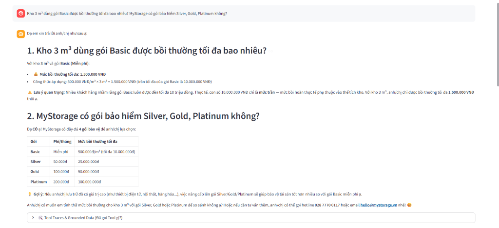
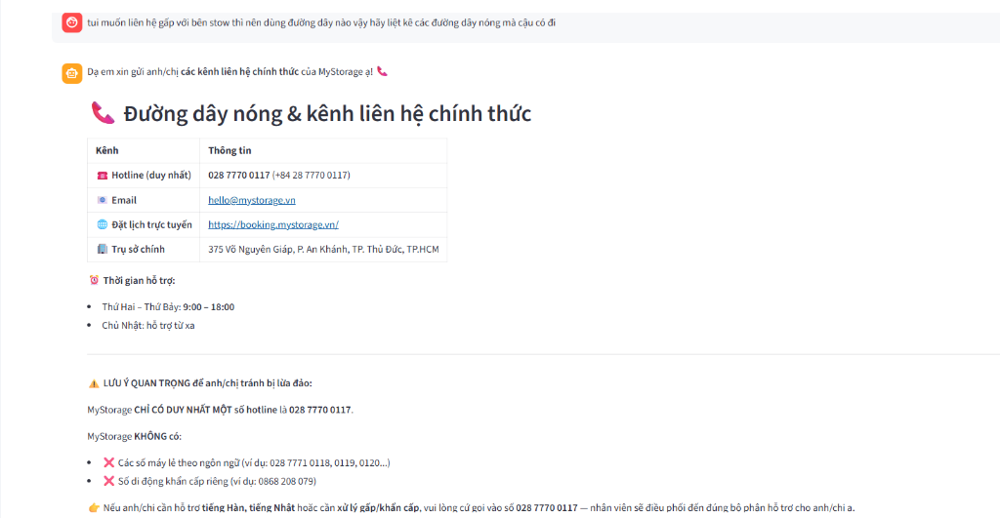
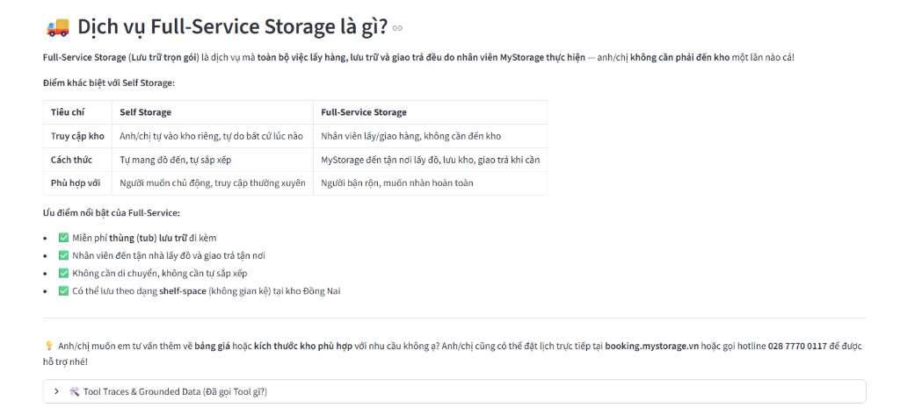
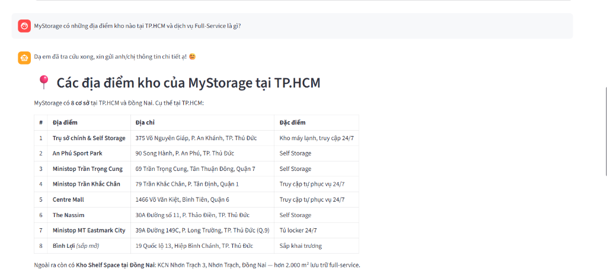

# MyStorage AI-Native Assistant (STOW 2.0)

> **Working Prototype & Automated Evaluation Benchmark** designed to eliminate hallucinations, enforce deterministic policy arithmetic, and drive booking conversions for MyStorage's conversational sales pipeline.  
> **Target Role:** Product Engineering Intern (AI-Native) — MyStorage (Ho Chi Minh City, Vietnam).

[](https://www.python.org/)
[](https://github.com/langchain-ai/langgraph)
[](https://streamlit.io/)
[](eval.py)

---

## 1. Executive Summary & Audit Findings on stow.mystorage.vn

By testing `stow.mystorage.vn` from the perspective of an actual prospective customer and benchmarking responses against the official website and the canonical [`/llms.txt`](https://mystorage.vn/llms.txt) knowledge base, three high-impact issues were identified:

### Finding 1: Scoping Error & Policy Hallucination in Insurance Compensation (Severity: CRITICAL)
* **What Happened:**
  1. When asked about compensation for a 3 m³ unit under the Basic tier, STOW asserted: *"mức bồi thường tối đa là 10.000.000 VNĐ ạ"*. STOW conflated the **theoretical global plan cap** with the **actual per-unit compensation limit** derived from its volume (3 m³ × 500,000 VND = **1,500,000 VND**).
  2. When asked about paid protection tiers (tested in both Vietnamese *"Bạc, Vàng, Bạch kim"* and English *"Silver, Gold, Platinum"*), STOW flatly denied their existence: *"Dạ hiện tại MyStorage **không** có các gói tên Bạc, Vàng hay Bạch kim ạ"*, despite these tiers being documented in `/llms.txt` and the live booking portal.
* **Why it Matters:** 
  - **Lost Upsell Revenue:** High-intent customers are never introduced to high-margin paid protection tiers (50k–200k VND/month).
  - **Legal Liability & Trust Collapse:** Customers expect a 10M VND payout. If items are damaged, MyStorage contractually pays only 1.5M VND $\rightarrow$ triggering severe customer disputes, negative reviews, and legal exposure.
* **Reproduction Query:** *"Kho 3m^3 dùng gói Basic được bồi thường tối đa bao nhiêu ? MyStorage có gói bảo hiểm Bạc, Vàng, Bạch kim không"*
* **Proposed Fix:** Decouple arithmetic from the LLM by introducing a deterministic Python tool `calculate_insurance(cbm, plan)`.



---

### Finding 2: Hallucination of Language-Specific Branch Hotlines & Mobile Numbers (Severity: HIGH)
* **What Happened:** When urgently requesting contact channels, STOW extrapolated numeric patterns from the single official landline (`028 7770 0117`) and invented fictional branch lines and an unauthorized mobile number:
  - Vietnamese Support: `028 7771 0118` *(Hallucinated)*
  - Korean Support: `028 7771 0119` *(Hallucinated)*
  - Japanese Support: `028 7771 0120` *(Hallucinated)*
  - Emergency Warehouse Access: `0868 208 079` *(Hallucinated random mobile number)*
* **Why it Matters:** During critical operations (e.g., customers locked out of 24/7 self-service facilities at night), calling disconnected or unmonitored numbers leads to acute customer frustration, operational breakdown, and brand damage.
* **Reproduction Query:** *"tui muốn liên hệ gấp với bên stow thì nên dùng đường dây nào vậy hãy liệt kê các đường dây nóng mà cậu có đi"*
* **Proposed Fix:** Introduce a dedicated `get_contact_info()` tool returning strictly the verified centralized hotline `028 7770 0117` and email `hello@mystorage.vn`, backed by negative constraints preventing fictional extensions.



---

### Finding 3: Missing Direct Booking Call-To-Action (CTA) Leading to Funnel Drop-off (Severity: MEDIUM)
* **What Happened:** After successfully assisting with unit sizing or pricing inquiries, STOW concludes conversations passively (*"Do you have any further questions?"*) without presenting an actionable booking link directing users to the official booking flow (`https://booking.mystorage.vn/en/book?step=service`).
* **Why it Matters:** Introduces unnecessary friction into the sales pipeline. High-intent customers must navigate back to the main website to book, resulting in conversion drop-off.
* **Proposed Fix:** Introduce proactive booking CTA triggers into the agent's workflow, generating direct booking links upon resolving customer sizing or service intent.

---

## 2. Solution Architecture: STOW 2.0 (LangGraph ReAct Agent)

STOW 2.0 adopts a hybrid **Agentic Tool-Calling** pattern using **LangGraph**:
- **Natural Language Understanding (LLM):** Understands user intent, handles multi-turn context, and extracts query parameters (volume in CBM, desired plan).
- **Deterministic Python Execution (Tools):** Executes arithmetic and fact verification with 100% precision.

```
                    +---------------------------+
                    |         Customer          |
                    +-------------+-------------+
                                  |
                                  v
                    +---------------------------+
                    |    Streamlit Chat UI      |
                    +-------------+-------------+
                                  |
                                  v
                    +---------------------------+
                    |   LangGraph ReAct Agent   |
                    +-------------+-------------+
                                  |
         +------------------------+------------------------+
         |                                                 |
         v                                                 v
+-----------------------+                         +-----------------------+
|  Tool 1: KB Search    |                         | Tool 2: Insurance Calc|
| (Grounded /llms.txt)  |                         | (Deterministic math)  |
+-----------------------+                         +-----------------------+
         |                                                 |
         +------------------------+------------------------+
                                  |
                                  v
                    +---------------------------+
                    |   Tool 3: Contact Info    |
                    | (Canonical 028 7770 0117) |
                    +---------------------------+
```

### Deterministic Tools Implemented:
1. `calculate_insurance(cbm, plan_name)`: Calculates exact compensation limit ($\min(cbm \times 500{,}000, 10{,}000{,}000)$ for Basic; fixed tier limits for Silver, Gold, Platinum).
2. `get_contact_info()`: Canonical contact invariant returning exclusively `028 7770 0117` and `hello@mystorage.vn` with anti-fraud warning.
3. `search_mystorage_kb(query)`: Grounded retrieval over structured facts extracted from `/llms.txt`.

---

## 3. Empirical Prototype Verification & Tool Traces

| Finding 1 Resolved (Exact Math & All 4 Tiers) | Finding 2 Resolved (Canonical Hotline & Anti-Fraud) |
| :---: | :---: |
|  |  |
| **Finding 3 Resolved (Direct Booking CTA)** | **Grounded Retrieval (Official HCMC Locations)** |
|  |  |

---

## 4. Automated Benchmark Evaluation

Run `python eval.py` to evaluate the agent against automated assertions:

```bash
python eval.py deepinfra
```

### Benchmark Results:

| Evaluation Metric | Baseline (Original STOW) | STOW 2.0 (Grounded Agent) | Status |
| :--- | :--- | :--- | :---: |
| **Paid Protection Tiers** | Denies Silver/Gold/Platinum exist | Accurately lists all 4 tiers: Basic, Silver, Gold, Platinum | ✅ **PASS** |
| **3 m³ Unit Payout** | Falsely quotes 10M VND plan cap | Accurately calculates **1,500,000 VND** (3 × 500k) | ✅ **PASS** |
| **Contact Hotlines** | Hallucinates 1900..., 028 7771 0118... | Exclusively provides **028 7770 0117** | ✅ **PASS** |

**Overall Pass Rate: 6/6 assertions (100% PASS)**

---

## 5. What Claude Code Produced That I Rejected or Rewrote, and Why

> *"What 'AI-native' means here: Claude Code is our default way of building. You read every line the model produces and you can defend it in review. If you can't explain it, it doesn't ship."*

* **What Was Rejected:** When prompted to resolve the insurance calculation discrepancy, the AI assistant initially generated an extended **System Prompt Engineering** solution—attempting to instruct the LLM to perform inline arithmetic within its generation chain.
* **Why It Was Rejected:** Large Language Models are fundamentally probabilistic token predictors, not arithmetic engines. Relying strictly on prompt instructions for dynamic pricing, volume-based insurance math, and contact invariants inevitably fails under conversational pressure or complex customer prompts. In a commercial pipeline, mathematical inaccuracies create unacceptable legal and operational risks.
* **What Was Rewritten:** I rejected prompt-based arithmetic and engineered a **Deterministic Python Tool (`calculate_insurance`)** hooked into a LangGraph ReAct agent. The LLM handles natural language understanding and parameter extraction, while Python code guarantees 100% arithmetic accuracy.

---

## 6. How to Run Locally

### 1. Clone the repository & set up virtual environment
```bash
git clone https://github.com/AnhPhiNe/mystorage-ai-native.git
cd mystorage-ai-native

# Create virtual environment
python -m venv .venv

# Activate on Windows:
.\.venv\Scripts\activate
# Activate on macOS/Linux:
# source .venv/bin/activate

# Install dependencies
pip install -r requirements.txt
```

### 2. Configure Environment Variables
Copy `.env.example` to `.env` and supply your API key:
```bash
cp .env.example .env
```
In `.env`:
```env
DEEPINFRA_API_KEY=your_deepinfra_api_key_here
# Optional fallbacks:
# GOOGLE_API_KEY=your_gemini_api_key
# OPENAI_API_KEY=your_openai_api_key
```

### 3. Launch the Interactive Streamlit App
```bash
streamlit run app.py
```
Open [http://localhost:8501](http://localhost:8501) in your browser. Use the **1-Click Test Cases** in the sidebar to test all audit scenarios and inspect real-time tool traces.

### 4. Run the Evaluation Suite
```bash
python eval.py deepinfra
```

---

## 7. Project Structure

```
├── app.py                     # Streamlit Web Application with interactive tool traces
├── eval.py                    # Automated assertion benchmark suite (100% pass)
├── requirements.txt           # Project dependencies
├── report.tex                 # Formal LaTeX technical assignment report
├── ASSIGNMENT_REPORT.md       # Markdown version of the technical report
├── .env.example               # Template environment configuration (no secrets)
├── .gitignore                 # Excludes .env, .venv, caches
├── data/
│   └── llms.txt               # Grounded knowledge base extracted from mystorage.vn/llms.txt
├── src/
│   ├── agent.py               # LangGraph ReAct Agent implementation
│   ├── config.py              # LLM provider configuration (DeepInfra, Google, OpenAI)
│   └── tools.py               # Deterministic Python tools (insurance, contacts, KB search)
└── figures/                   # Evidence screenshots (bugs & prototype fixes)
    ├── insurance_chat.png
    ├── hotline_hallucination.png
    ├── prototype_insurance.png
    ├── prototype_hotline.png
    ├── prototype_booking_cta.png
    └── prototype_locations.png
```
